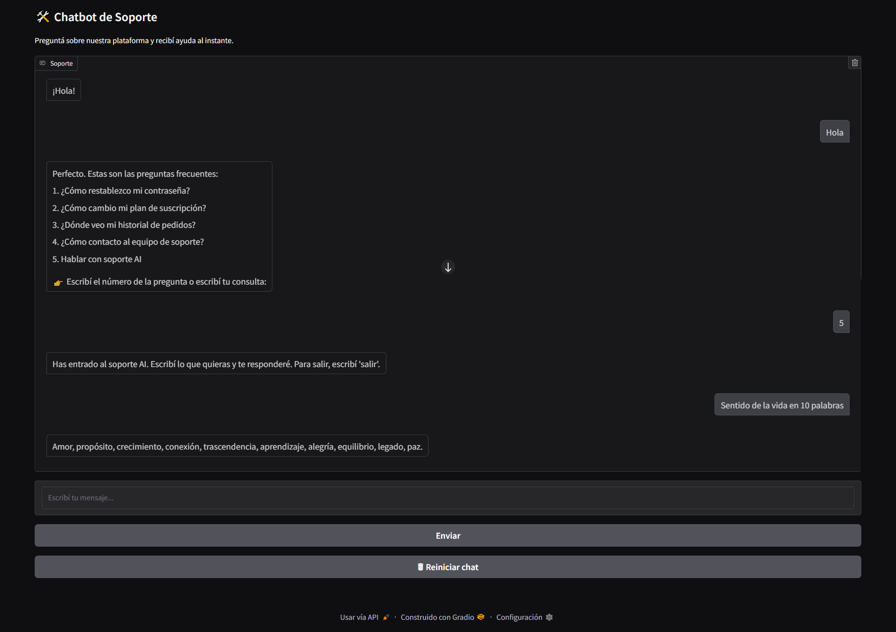

# 🤖 Chatbot de Soporte con Gradio y AI21

Este proyecto es un chatbot de soporte al cliente construido con [Gradio](https://www.gradio.app/) y la API de [AI21 Labs](https://www.ai21.com/). Permite responder preguntas frecuentes y también ofrece un modo de chat libre con inteligencia artificial.



## 🚀 Funcionalidades

- Menú con preguntas frecuentes (FAQ)
- Opción para hablar con una IA de soporte
- Respuestas generadas con el modelo `jamba-large-1.7` de AI21
- Interfaz moderna con Gradio
- Reinicio de chat con un clic

## 🧰 Requisitos

- Python 3.9 o superior
- Cuenta en [AI21 Labs](https://www.ai21.com/) y clave API

## 🛠️ Instalación

```bash
git clone https://github.com/tuusuario/chatbot-ai21.git
cd chatbot-ai21
python -m venv venv
source venv/bin/activate  # En Windows: venv\Scripts\activate
pip install -r requirements.txt
```

## 🔐 Configuración

Crea un archivo `.env` en la raíz del proyecto con tu clave de API de AI21:

```env
AI21_API_KEY=tu_clave_api_aqui
```

## ▶️ Uso

```bash
python app.py
```

El chatbot estará disponible en [http://127.0.0.1:7860](http://127.0.0.1:7860) (o el puerto indicado por Gradio).

## 📁 Estructura del proyecto

```
├── app.py              # Código principal del chatbot
├── .env                # Variables de entorno (no se sube)
├── .gitignore          # Archivos ignorados por Git
├── requirements.txt    # Dependencias
└── README.md           # Este archivo
```

## 📜 Licencia

Este proyecto es de código abierto bajo la licencia MIT.
